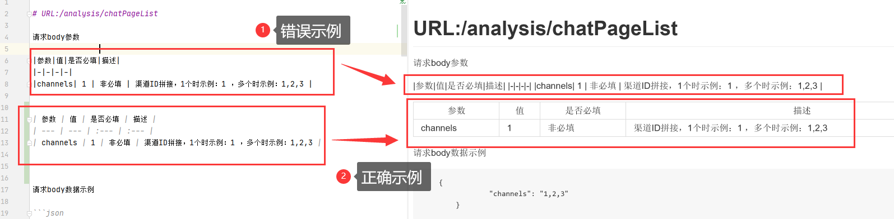
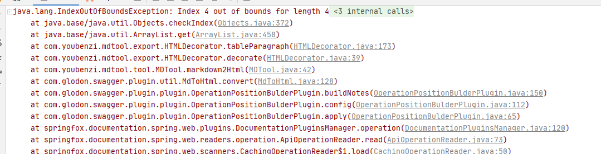

# 说明文档


可以通过下main这个依赖引入，使用：

```xml
<dependency>
  <groupId>com.truedei.swagger.plugin</groupId>
  <artifactId>truedei-swagger-plugin</artifactId>
  <version>0.0.1-SNAPSHOT</version>
</dependency>
```

## 一、项目介绍
> 此项目是对springfox-swagger2的一个功能上的扩展


pom.xml文件中，此处为什么要这样做：

```xml
    <!-- 引入swgger相关依赖       -->
        <dependency>
            <groupId>io.springfox</groupId>
            <artifactId>springfox-swagger2</artifactId>
            <version>2.9.2</version>
            <exclusions>
                <exclusion>
                    <groupId>io.swagger</groupId>
                    <artifactId>swagger-models</artifactId>
                </exclusion>
            </exclusions>
        </dependency>

        <dependency>
            <groupId>io.swagger</groupId>
            <artifactId>swagger-models</artifactId>
            <version>1.5.21</version>
        </dependency>
```

原因：
> 因为在springfox-swagger2版本为2.9.2的依赖中，是依赖swagger-models版本为1.5.20的依赖的。
> 但是1.5.20的依赖是存在bug的，当访问swagger的时候，会出现：`DefaultValue for parameter type integer`类似的BUG


如下面博客中所提及到的：

https://blog.csdn.net/boyin333/article/details/87980108

《swagger2 Illegal DefaultValue for parameter type integer》
看了网上不少的解决方法

1、@ApiModelProperty(value = "主键", example = "123") ，太麻烦而且还是报错

2、修改jar源码，对于新手来说难度系数太大

经过一番思考，采用如下方案：使用pom的 exclusions方式

```xml
<dependency>
    <groupId>io.springfox</groupId>
    <artifactId>springfox-swagger2</artifactId>
    <version>2.9.2</version>
    <exclusions>
        <exclusion>
            <groupId>io.swagger</groupId>
            <artifactId>swagger-models</artifactId>
        </exclusion>
    </exclusions>
</dependency>
 
<dependency>
    <groupId>io.swagger</groupId>
    <artifactId>swagger-models</artifactId>
    <version>1.5.21</version>
</dependency>
```

排除swagger2本身引用的swagger-models-1.5.20.jar【这版本有bug】，引入更高的版本即可解决问题。


## 二、需要注意的事项

关于表格，一定要可以在某些工具中可以解析出来。




否则就会报异常：




## 三、功能列表
如何添加任务：
- [x] 1、 任务一 `- + 空格 + [ ]`
- [ ] 2、 任务二 `- + 空格 + [x]`

### （一）短期任务
> 短期任务：此处记录的功能不包括swagger已有的功能，只记录对其扩展的一些功能。

- [x] 1、 支持使用注解动态生成实体类（@Apicp & @ApiIgp）；
- [x] 2、 支持从文件中读取一些接口描述信息（@APiFileInfo）；
- [x] 3、 支持api分组（@ApiVersion）；
- [x] 4、 支持开启此扩展项目的开关的功能（@EnableSwaggerPlugin）；
- [x] 5、 @Apicp和ApiIgp支持参数示例;
- [x] 6、 @Apicp和ApiIgp支持参数是否必填选项;
- [x] 7、 支持配置从配置好的任意package路径读取md文件; 
- [ ] 9、 配置相应的log日志输出功能;
- [ ] 10、 支持参数排序;(存在问题，暂时无法解决)

### （二）长期任务

> 长期任务：持续要做的
>
> 1、做到0使用swagger-bootstrap UI框架的代码，因为

- [ ] 1、 支持Layui自定义UI；
- [ ] 2、 减少使用swagger-bootstrap UI的依赖程度，做到0使用
- [ ] 3、 支持排序，逐渐的从swagger-bootstrap UI 脱离 增强功能，实现自己的排序功能

自定义UI计划：
- [ ] 支持动态生成左侧导航菜单
- [ ] api为post请求时，body传入str，支持请求示例的展示


# 使用说明
## 1、 支持使用注解动态生成实体类（@Apicp & @ApiIgp）；
## 2、 支持从文件中读取一些接口描述信息（@APiFileInfo）；
## 3、 支持api分组（@ApiVersion）；
## 4、 支持开启此扩展项目的开关的功能（@EnableSwaggerPlugin）；
## [ ] 5、 @Apicp和ApiIgp支持参数示例;
## [ ] 6、 @Apicp和ApiIgp支持参数是否必填选项;
## [x] 7、 支持配置从配置好的任意package路径读取md文件; 

只需要在application.yml中配置上：

例子：
> 其中com.springbootswagger1.controller为你项目的controller路径
```xml
swagger-plugin:
    scanpath: com.springbootswagger1.controller
```


## [ ] 9、 配置相应的log日志输出功能;
## [ ] 10、 支持参数排序;


# 更新日志记录
## 1、2021年1月15日更新记录

时间：2021年1月15日15:28:

更新内容：
> （1）、@Apicp和ApiIgp支持参数示例;
>
> （2）、@Apicp和ApiIgp支持参数是否必填选项;
>
> （3）、 支持配置从配置好的任意package路径读取md文件; 
>


